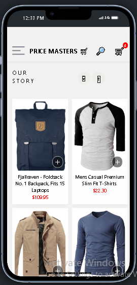

# rn-assignment7-11210750
# Project Design and Implementation

## Design Choices

In designing this app, we focused on user experience, performance, and scalability. We chose React Native with Expo for cross-platform compatibility, ensuring a smooth user experience across both iOS and Android devices. For the UI, we utilized a minimalist approach, emphasizing ease of use and intuitive navigation.

## Screenshots

*Home Screen - The main interface where users interact with the app.*

*Cart Screen

## Implementation

The app's core functionality is built around React Navigation for screen management and Redux for state management. This combination allows for a seamless flow between screens and a consistent state across the app. We utilized async storage for local data caching, reducing load times and improving the overall user experience.

For authentication, we integrated Firebase Authentication, supporting multiple sign-in methods including email/password, Google, and Facebook. This provides users with flexibility and security when accessing the app.

## Conclusion

Our design and implementation choices were driven by the goal of creating a user-friendly, efficient, and scalable app. By leveraging modern technologies and best practices, we've built an application that meets these criteria and provides a solid foundation for future enhancements.